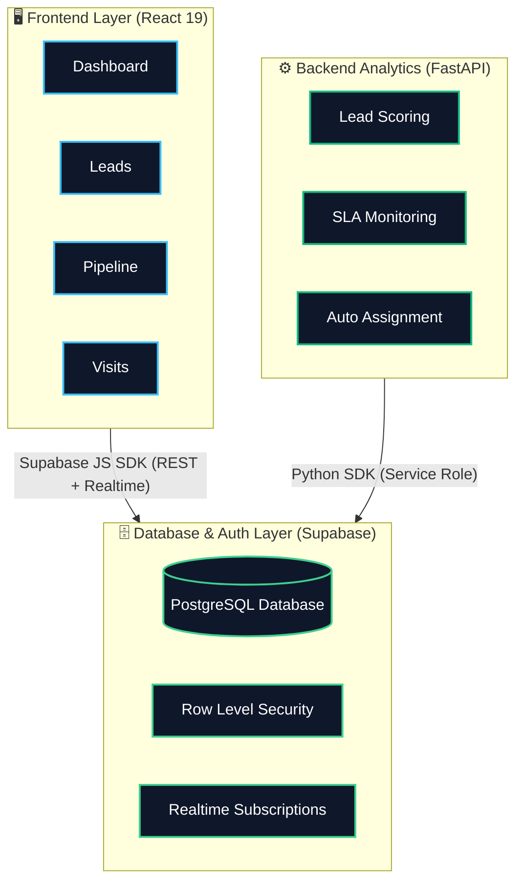
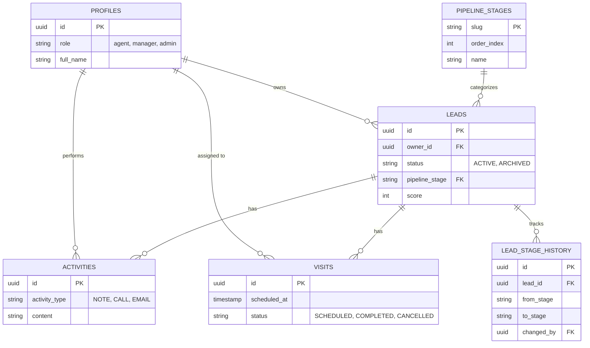

<div align="center">
  <h1>🏡 Gharpayy — Lead Management CRM</h1>
  <p><em>A full-stack, production-grade Lead Management System built in 48 hours</em></p>
  
  <p>
    
    
    
    
    
    
  </p>
</div>

<br/>

> **Gharpayy** captures leads, assigns ownership, manages a sales pipeline, schedules property visits, and provides a real-time dashboard — all backed by a production-grade **Supabase** database and a **FastAPI** analytics backend.

---

## 🏗️ Architecture Overview

The application is structured into three main layers: a modern React frontend, a scalable BaaS database, and a high-performance Python backend.



---

## 📦 Tech Stack

| Layer | Technology | Purpose |
|:------|:-----------|:--------|
| 🎨 **Frontend** | React 19 + TypeScript | UI framework |
| 🔀 **Routing** | TanStack Router | Type-safe client routing (file-based) |
| ⚡ **Server State** | TanStack Query | Caching, mutations, invalidation |
| 💅 **Styling** | Tailwind CSS + shadcn/ui | Utility-first CSS + accessible components |
| 🛠️ **Build** | Vite | Fast dev server + bundling |
| 🗄️ **Database** | Supabase (PostgreSQL) | Managed Postgres with Auth + RLS |
| ⚙️ **Backend** | FastAPI (Python) | Scoring engine, SLA monitor, analytics |
| 🔐 **Auth** | Supabase Auth | Email/password signup, session management |
| 🛡️ **Security** | Row Level Security (RLS) | Role-based data access (agent/manager/admin) |

---

## ✅ Assignment Requirements — Checklist

| Requirement | Status | Implementation |
|:---|:---:|:---|
| **Capture leads** | 🟢 | Add Lead form with name, phone, email, source, budget, area, move-in date, notes |
| **Assign ownership** | 🟢 | Manual assignment + backend round-robin auto-assignment |
| **Manage a pipeline** | 🟢 | Kanban board with 7 stages, state-machine transitions, stage history |
| **Schedule visits** | 🟢 | Visit scheduling with conflict detection, complete/cancel lifecycle |
| **Simple dashboard** | 🟢 | Real-time KPIs (total leads, conversion rate, visits today, pipeline value) |
| **Fully usable** | 🟢 | Real Supabase database, Auth, RLS — not a mockup |
| **Proper flows** | 🟢 | Lead capture → assignment → pipeline → visit → close |
| **Scalability** | 🟢 | Indexed queries, role-based RLS, service layer separation |

---

## 🧩 Features Built

### 🖥️ Frontend (React)

- **📊 Dashboard**
  - Live KPI cards: total leads, conversion rate, today's visits, pipeline value.
  - Recent leads list with stage badges.
  - Quick-action buttons (Add Lead, Pipeline view).

- **🧑‍💼 Lead Management**
  - Full CRUD with search and stage filtering.
  - Lead detail page with contact info, stage transitions, notes, activity timeline.
  - Inline note-taking with real-time timeline updates.

- **🗂️ Pipeline Board**
  - Kanban-style view with 7 stages: *New → Contacted → Qualified → Visit Scheduled → Negotiation → Won / Lost*.
  - State-machine enforced transitions (e.g., can't jump from New to Won).
  - Stage history tracking (who moved, when, why).

- **📅 Visit Scheduling**
  - Schedule visits linked to leads.
  - Conflict detection (warns if agent already has a visit at same time).
  - Complete/Cancel lifecycle with status badges.

- **🔐 Auth System**
  - Email/password signup + login.
  - Auto-profile creation via DB trigger.
  - Role-based access (agent sees own leads, manager sees all).

- **⌨️ Command Palette (⌘K)**
  - Quick jump to any lead by name.
  - Fast navigation across the app.

### ⚙️ Backend (FastAPI)

- **📈 Lead Scoring Engine** (`POST /api/scoring/run`)
  - Weighted formula: *Budget (30%) + Recency (30%) + Engagement (40%)*.
  - Auto-updates lead scores in DB.
  - Per-lead scoring via `POST /api/scoring/lead/{id}`.

- **⏱️ SLA Monitoring** (`GET /api/sla/breaches`)
  - Warns at 24h idle, critical at 48h idle.
  - Per-agent SLA compliance report (`GET /api/sla/agents`).

- **🔄 Round-Robin Assignment** (`POST /api/assignment/auto`)
  - Auto-assigns unassigned leads to agents in rotation.
  - Persisted rotation counter in DB.
  - Workload distribution view (`GET /api/assignment/workload`).

- **📊 Analytics APIs**
  - `GET /api/analytics/pipeline` — Funnel with conversion rates.
  - `GET /api/analytics/sources` — Lead source breakdown.
  - `GET /api/analytics/activity?days=7` — Daily activity trends.
  - `GET /api/analytics/agents` — Win rate, visits completed per agent.

---

## 🗄️ Database Design

The database employs **7 tables**, **5 enums**, **8 indexes**, and **16 RLS policies**.



### 🎯 Key Design Decisions

- **Enums over strings**: `user_role`, `lead_status`, `activity_type`, `visit_status`, `pipeline_stage_slug` — enforced at DB level.
- **Soft deletes**: Leads use `status = ARCHIVED` instead of hard delete.
- **Audit trail**: Every stage change is logged in `lead_stage_history` with actor + reason.
- **Auto-timestamps**: `updated_at` triggers on leads, profiles, visits.
- **Auto-profile creation**: DB trigger on `auth.users` insert creates a matching profile row.

### 🛡️ Row Level Security (RLS)

| Table | Agent Access | Manager/Admin Access |
|:------|:-------------|:---------------------|
| `leads` | Own leads only | All leads |
| `visits` | Own visits only | All visits |
| `activities` | Via lead ownership | All |
| `profiles` | Read all, update own | Read all, update own |
| `pipeline_stages` | Read only | Read only |

> 📄 *Full schema can be found in:* [`frontend/supabase/schema.sql`](frontend/supabase/schema.sql)

---

## 🚀 Setup & Run

### Prerequisites

- **Node.js 18+** and **npm**
- **Python 3.11+**
- **Supabase project** (free tier works)

### 1️⃣ Clone the Repository

```bash
git clone https://github.com/YOUR_USERNAME/Gharpayy.git
cd Gharpayy
```

### 2️⃣ Frontend Setup

```bash
cd frontend
cp .env.example .env  # Add your Supabase URL + anon key
npm install
npm run dev           # App runs on http://localhost:8080
```

> **Environment variables** (`.env`):
> ```env
> VITE_SUPABASE_URL=https://your-project.supabase.co
> VITE_SUPABASE_ANON_KEY=your-anon-key
> ```

### 3️⃣ Database Setup

Run the schema in your Supabase SQL Editor:

```sql
-- Copy and paste the contents of frontend/supabase/schema.sql
```

> *This creates all tables, enums, indexes, triggers, RLS policies, and seeds pipeline stages.*

### 4️⃣ Backend Setup

```bash
cd backend
pip install -e .       # Or: pip install fastapi uvicorn supabase python-dotenv pydantic-settings
cp .env.example .env   # Add your Supabase URL + service_role key
uvicorn main:app --reload --port 8000  # API runs on http://localhost:8000
```

> **Environment variables** (`.env`):
> ```env
> SUPABASE_URL=https://your-project.supabase.co
> SUPABASE_SERVICE_KEY=your-service-role-key
> ```

### 5️⃣ Supabase Settings

In your Supabase Dashboard:
1. **Settings → Auth → Email**: Disable "Confirm email" for easy testing.
2. **Settings → Auth → General**: Enable signup.
3. **Settings → API**: Copy `anon` key (for frontend) and `service_role` key (for backend).

---

## 📡 Backend API Reference

| Method | Endpoint | Description |
|:-------|:---------|:------------|
| <kbd>GET</kbd> | `/health` | Health check |
| <kbd>POST</kbd> | `/api/scoring/run` | Re-score all active leads |
| <kbd>POST</kbd> | `/api/scoring/lead/{id}` | Score a specific lead |
| <kbd>GET</kbd> | `/api/sla/breaches` | Check SLA violations |
| <kbd>GET</kbd> | `/api/sla/agents` | Agent SLA compliance |
| <kbd>POST</kbd> | `/api/assignment/auto` | Auto-assign lead (round-robin) |
| <kbd>GET</kbd> | `/api/assignment/workload` | Agent workload distribution |
| <kbd>GET</kbd> | `/api/analytics/pipeline` | Pipeline funnel + conversion |
| <kbd>GET</kbd> | `/api/analytics/sources` | Lead source breakdown |
| <kbd>GET</kbd> | `/api/analytics/activity?days=7` | Daily activity trends |
| <kbd>GET</kbd> | `/api/analytics/agents` | Agent performance metrics |

> 💡 *Interactive docs available at:* `http://localhost:8000/docs` (Swagger UI)

---

## 📁 Project Structure

```text
Gharpayy/
├── frontend/                    # React frontend
│   ├── src/
│   │   ├── components/          # UI components (AppShell, ProfileMenu, etc.)
│   │   ├── hooks/               # TanStack Query hooks
│   │   ├── lib/                 # Supabase client, auth context, DB types
│   │   ├── routes/              # File-based routes (TanStack Router)
│   │   └── services/            # Supabase service layer API calls
│   └── supabase/
│       └── schema.sql           # Complete database schema
│
├── backend/                     # FastAPI backend
│   ├── main.py                  # App entry + routes
│   ├── config.py                # Pydantic settings
│   ├── db.py                    # Supabase client singleton
│   ├── scoring.py               # Lead scoring engine
│   ├── sla.py                   # SLA breach monitor
│   ├── assignment.py            # Round-robin assignment
│   └── analytics.py             # Pipeline/agent analytics
│
└── README.md                    # This documentation file
```

---

## 🔒 Security

- **Supabase Auth**: Email/password authentication with JWT sessions.
- **Row Level Security**: 16 policies ensure agents only see their own data; managers see everything.
- **Service-role isolation**: Backend uses `service_role` key (server-side only, never exposed to browser).
- **CORS**: Backend restricted to frontend origin only.
- **Input validation**: Pydantic models for all API inputs.

---

## 🗺️ Future Improvements

- [ ] 📱 WhatsApp/SMS notification integration
- [ ] 📧 Email templates for lead follow-ups
- [ ] 📥 Bulk import leads via CSV
- [ ] 🤖 Lead scoring model training (ML)
- [ ] ⚡ WebSocket-based real-time pipeline updates
- [ ] 📱 Mobile-responsive PWA
- [ ] 🏢 Multi-tenancy for agency teams

---

## 🛠️ Built With

- [React 19](https://react.dev) + [TypeScript](https://www.typescriptlang.org/)
- [TanStack Router](https://tanstack.com/router) + [TanStack Query](https://tanstack.com/query)
- [Tailwind CSS](https://tailwindcss.com/) + [shadcn/ui](https://ui.shadcn.com/)
- [Supabase](https://supabase.com/) (PostgreSQL + Auth + RLS)
- [FastAPI](https://fastapi.tiangolo.com/) + [Pydantic](https://docs.pydantic.dev/)
- [Vite](https://vitejs.dev/) (build tool)
