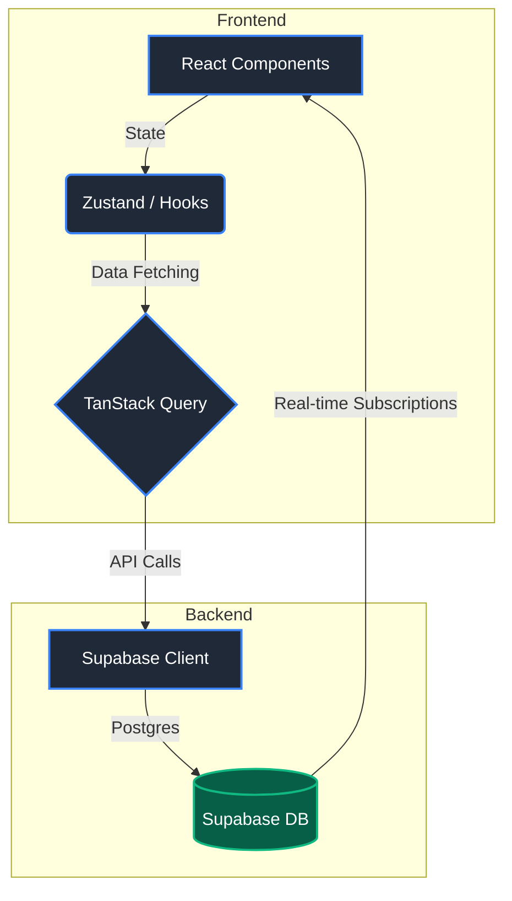

<div align="center">
  <h1>🌟 Ops1G Lead Management CRM</h1>

  <p>
    <strong>A Production-Ready, High-Performance CRM built with TanStack Start & Supabase</strong>
  </p>

  <!-- Badges -->
  <p>
    
    
    
    
    
  </p>
</div>

---

## 📖 Overview

**Ops1G** is a modern, end-to-end Lead Management CRM designed to streamline sales pipelines, manage customer visits, and track leads from initial contact to conversion. Transitioned from a rapid prototype to a **production-ready** application, it features robust role-based access control, real-time database synchronization via **Supabase**, and lightning-fast rendering powered by **TanStack Start**.

---

## ✨ Key Features

*   **🔐 Secure Authentication**: Integrated with Supabase Auth for seamless and secure user login/registration.
*   **📊 Interactive Pipeline**: Visual pipeline management for tracking lead progression through various stages.
*   **👥 Lead Management**: Comprehensive operations for leads with type-safe schemas and real-time updates.
*   **📅 Visit Tracking**: Schedule, log, and monitor client visits and meetings efficiently.
*   **🎨 Premium UI/UX**: Built with **shadcn/ui**, **Tailwind CSS**, and **Framer Motion** for a visually stunning, responsive, and accessible user experience.
*   **📈 Data Visualization**: Built-in charts and analytics using **Recharts** to monitor team performance.

---

## 🏗️ Architecture & Data Flow



---

## 🛠️ Tech Stack

### Frontend 
*   **Framework**: [TanStack Start](https://tanstack.com/start) & React 19
*   **Routing**: [TanStack Router](https://tanstack.com/router)
*   **Styling**: [Tailwind CSS v4](https://tailwindcss.com/)
*   **Components**: [shadcn/ui](https://ui.shadcn.com/) (Radix UI)
*   **State Management**: [Zustand](https://zustand-demo.pmnd.rs/) & [TanStack Query](https://tanstack.com/query)
*   **Animations**: [Framer Motion](https://www.framer.com/motion/)

### Backend & Infrastructure
*   **Database / Auth**: [Supabase](https://supabase.com/)
*   **Validation**: [Zod](https://zod.dev/) for runtime type safety
*   **Build Tool**: [Vite](https://vitejs.dev/)

---

## 📂 Project Structure

```text
ops1g/
├── src/
│   ├── components/       # Reusable UI components (shadcn/ui + custom)
│   ├── hooks/            # Custom React hooks & TanStack Query mutations
│   ├── lib/              # Utility functions, Supabase client setup
│   ├── routes/           # TanStack Router route definitions & pages
│   ├── services/         # API wrappers & business logic
│   ├── router.tsx        # Router configuration
│   └── styles.css        # Global Tailwind/CSS styles
├── supabase/             # Supabase migrations & configurations
├── package.json          # Project dependencies & scripts
├── vite.config.ts        # Vite configuration
└── .env                  # Environment variables
```

---

## 🚀 Getting Started

Follow these instructions to set up the project locally.

### Prerequisites

*   **Node.js** (v18+)
*   **npm**, **yarn**, or **bun**
*   A **Supabase** account and project

### 1. Clone & Install

```bash
git clone <your-repo-url>
cd ops1g
npm install
```

### 2. Environment Setup

Create a `.env` file in the root directory and add your Supabase credentials:

```env
VITE_SUPABASE_URL=your_supabase_project_url
VITE_SUPABASE_ANON_KEY=your_supabase_anon_key
```

> **Note:** Ensure your Supabase project has the correct tables (leads, pipeline, visits) deployed.

### 3. Run Development Server

```bash
npm run dev
```

The app will be available at `http://localhost:5173`.

---

## 🧪 Commands & Scripts

| Command | Description |
| :--- | :--- |
| `npm run dev` | Starts the Vite development server |
| `npm run build` | Builds the app for production |
| `npm run preview` | Previews the production build locally |
| `npm run lint` | Runs ESLint to check for code issues |
| `npm run format`| Formats codebase using Prettier |

---

## 🤝 Contributing

1. Fork the repository
2. Create your feature branch (`git checkout -b feature/AmazingFeature`)
3. Commit your changes (`git commit -m 'Add some AmazingFeature'`)
4. Push to the branch (`git push origin feature/AmazingFeature`)
5. Open a Pull Request

---

## 📄 License

This project is licensed under the MIT License.

<div align="center">
  <p>Engineered with ❤️ for Production.</p>
</div>
